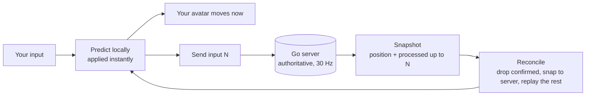

# PunchPunchPunch

A small browser multiplayer game: characters walk a tiny spherical planet of wind-blown grass under a
cozy morning sky, gliding across each other's screens over a real network round-trip. The visible game is
deliberately simple. The point of the project is what is underneath it: **authoritative-server netcode
with client-side prediction and reconciliation, written from scratch in Go**, and **stylized rendering
from custom GLSL** rather than model detail.

**▶ Play it live: [slint.live](https://slint.live)**

---

## See the netcode working (the ten-second version)

Netcode is invisible when it works, so the game ships with a way to see it. On the live site:

1. Press **`I`** to open the netcode HUD (round-trip time, server tick, prediction error, corrections/sec, bytes/sec).
2. Drag the **latency slider** up to 200 ms. Your own movement still answers your keys **instantly**.
3. Press **`O`** to turn prediction **off**. Now your keys lag the screen by a full round-trip and the character rubber-bands.

That difference — instant versus laggy under the same fake latency — is the entire project in one toggle.

---

## How it works

The server is authoritative and runs a fixed **30 Hz** tick. If the client simply waited for it, every step
would cost a full round-trip and movement would rubber-band. Instead:

- **Client-side prediction** — your input is applied to a local copy of your player *immediately*, so the
  avatar answers your keys with zero delay, and the same input is sent up to the server.
- **Reconciliation** — each server snapshot says *"I processed your input up to #N, and you were here."*
  The client drops the inputs the server has now confirmed, snaps its prediction to the server's truth, and
  **replays the remaining unconfirmed inputs** to land back at "now." A correction small enough to be
  imperceptible eases in over a few frames; a large one snaps.
- **One shared simulation** — the movement math (a great-circle walk across the sphere) is written once and
  mirrored line-for-line in TypeScript (client) and Go (server). Because both run the *identical* step, and
  the client replays its own inputs, corrections are normally near zero. A **golden test** feeds the same
  inputs through both languages and fails if the two trajectories ever diverge, so they cannot silently
  drift apart.
- **Remote players** are drawn from a snapshot buffer, rendered ~100 ms in the past and interpolated
  between snapshots so they glide smoothly over network jitter instead of teleporting.
- **Clock sync** rides a ping/pong handshake, so "100 ms in the past" means the same instant on both ends.
- **The wire** is one `.proto` generating both the Go and TypeScript message types. Frames are JSON by
  default for readability; a HUD switch flips the whole connection to protobuf live, and the byte-rate
  readout shows the difference on a running game.



---

## Architecture

**Split hosting.** The static client is served from Firebase Hosting; the Go server runs on a small AWS
Lightsail box behind Caddy, which terminates TLS. They live on two subdomains of `slint.live`, so the
client dials `wss://api.slint.live/ws`.

- **Client** — Three.js for rendering with real lights plus hand-written GLSL for the sky and grass,
  TypeScript (strict), bundled by Vite. No game engine or editor; it is pure code.
- **Server** — Go, no framework. A 30 Hz tick loop with per-player input inboxes, join/leave by membership
  diffing, and a single goroutine as the sole writer to every socket.

## Optional plug-ins

Three features hang off the core, each removable without touching the game loop:

- **Login / identity** — a `/login` endpoint checks bcrypt-hashed accounts and returns an HMAC-signed
  token the socket carries; your account name floats over your head instead of a random one. A login is
  remembered for 24 h; a guest session is remembered only for the browser tab.
- **Stats persistence** — a pure-Go SQLite store saves a logged-in player's last position on leave and
  loads it on join, so you resume exactly where you left off after a restart or a deploy.
- **Telegram notifications** — a listener pings a chat when someone joins or leaves, with a grace period so
  a refresh does not spam it.

---

## Run it locally

Two terminals — the client and the server.

```bash
# terminal 1: the game server
cd server
go run .            # listens on ws://localhost:8080

# terminal 2: the client
cd client
npm install         # first time only
npm run dev         # opens http://localhost:5173
```

Open the printed local address. Vite also prints a `Network:` address you can open on a phone on the same
wifi to test a second player. TypeScript is checked separately (Vite does not type-check): run
`npm run typecheck` in the client, and `go test ./...` in the server for the sim's golden test and the rest.

**Controls.** WASD or arrow keys to move (hold Shift to walk, release to run), left-mouse drag to swing the
camera. On a phone: the bottom-center joystick moves, drag elsewhere to look.

## Repo layout

```
client/
  src/
    main.ts          wiring + the fixed-tick / render loop
    sim.ts           the shared movement sim (mirrored in Go)
    systems/         prediction + reconciliation, snapshot interpolation, input, camera
    net/             the socket, codec, clock sync, generated protobuf
    shaders/         all GLSL (sky, grass)
    world/ entities/ planet, grass, sky, lights, the character
server/
  main.go hub.go tick.go   accept + membership + the 30 Hz loop
  sim/                     the walk math mirrored from the client
  sim/sim_test.go          the golden test holding the two sims together
proto/game.proto           one schema, generates Go + TypeScript
```

## Credits

- Characters: Quaternius "Ultimate Animated Characters" (CC0).
- Nature props: Stylized Nature MegaKit.
- Built with [Three.js](https://threejs.org) and Go.
